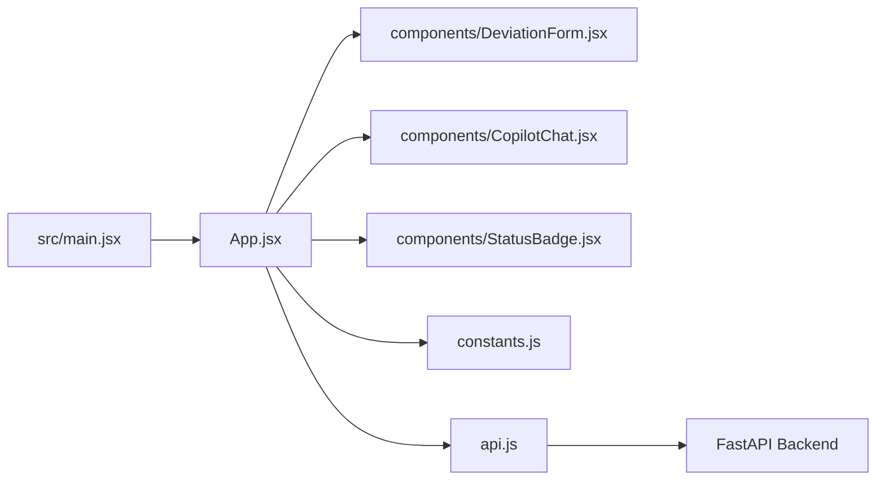

# DeviationIQ Frontend

React/Vite interface for the DeviationIQ two-panel deviation intake and Copilot workflow.

## Deployment

Current frontend deployment:

[https://gracious-enjoyment-production-524c.up.railway.app/](https://gracious-enjoyment-production-524c.up.railway.app/)

The production build is configured to call the Railway FastAPI backend through `VITE_API_BASE_URL`.

## Runtime Model

The frontend is intentionally thin. It manages the visible deviation form, Copilot conversation, upload state, save state, and API calls, while extraction, correction, risk assessment, and persistence run in the FastAPI backend.

`src/App.jsx` owns the main application state. The left panel renders deviation fields and impact/severity output through `DeviationForm.jsx`; the right panel renders the Copilot conversation and document upload controls through `CopilotChat.jsx`.

The frontend does not call Groq directly, parse PDFs locally, or write to the database. All backend communication goes through `src/api.js`.

## Component Graph



## Interaction Flow

1. A QA user enters a deviation description in the Copilot or uploads a supported document.
2. `App.jsx` sends the message or file to the backend through `api.js`.
3. The backend returns a structured `form`, `risk_assessment`, `status`, and Copilot `assistant_message`.
4. `App.jsx` merges the returned fields into the current state.
5. Fields returned by AI are marked in `changedFields` and shown as AI-generated in the form.
6. The user can send natural-language corrections such as “change the affected quantity to 18,500 tablets.”
7. The backend returns only the corrected fields plus any reassessed risk output.
8. The user saves the deviation with `Save Deviation`, which posts the current form and risk assessment to `/api/save`.
9. The user can reset the current intake with `Reset Deviation`.

## State Model

| State | Source file | Purpose |
| ----- | ----------- | ------- |
| `form` | `src/App.jsx` | Current deviation field values rendered in the form. |
| `risk` | `src/App.jsx` | Current severity, recommended action, and impact assessment text. |
| `status` | `src/App.jsx` | Backend readiness status, including `ready_to_save`. |
| `messages` | `src/App.jsx` | Copilot conversation shown in the right panel. |
| `changedFields` | `src/App.jsx` | Tracks fields populated or updated by AI. |
| `loading` | `src/App.jsx` | Disables Copilot actions while chat/upload is in progress. |
| `committing` | `src/App.jsx` | Disables save while persistence is in progress. |
| `lastSavedRecord` | `src/App.jsx` | Stores the most recent save response record id. |

The empty form and section definitions live in `src/constants.js`. Some form keys retain legacy internal names such as `complaint_source`, `complaint_category`, and `complaint_description` for backend compatibility, but visible UI labels use deviation terminology.

## Components

| File | Responsibility |
| ---- | -------------- |
| `src/main.jsx` | Mounts the React application. |
| `src/App.jsx` | Coordinates state, API calls, upload handling, save/reset behavior, and Copilot messages. |
| `src/api.js` | Centralized HTTP client for FastAPI endpoints. |
| `src/constants.js` | Empty form/risk defaults and visible form section labels. |
| `src/components/DeviationForm.jsx` | Left-panel deviation details, impact/severity output, save action, and reset action. |
| `src/components/CopilotChat.jsx` | Right-panel Copilot messages, text input, file upload, and loading state. |
| `src/components/StatusBadge.jsx` | Intake status display. |

## API Integration

`src/api.js` resolves the backend base URL from:

```js
import.meta.env.VITE_API_BASE_URL || "http://localhost:8000"
```

| Function | Endpoint | Purpose |
| -------- | -------- | ------- |
| `checkHealth()` | `GET /api/health` | Backend health check. |
| `sendChatMessage(message, currentForm, currentRisk)` | `POST /api/chat` | Sends new descriptions, corrections, or general Copilot messages. |
| `uploadDocument(file, currentForm, currentRisk)` | `POST /api/upload` | Uploads PDF/TXT/EML-style text files for extraction. |
| `saveDeviation(form, riskAssessment)` | `POST /api/save` | Persists the current deviation record. |

The API wrapper distinguishes network/CORS failures from backend JSON errors where possible and returns readable messages to the UI.

## Document Upload Flow

`CopilotChat.jsx` accepts:

- `.pdf`
- `.txt`
- `.eml`

Uploads are sent as `multipart/form-data` with:

| Field | Purpose |
| ----- | ------- |
| `file` | Uploaded document. |
| `current_form` | Serialized current form state. |
| `current_risk` | Serialized current risk assessment state. |

The backend extracts text and returns the same response shape as `/api/chat`, so the frontend can apply document extraction results through the same state update path.

## Form And Assessment Display

`DeviationForm.jsx` renders the current deviation as a structured, read-only intake form. AI-populated fields are marked with an AI indicator, and the impact/severity section displays:

- Severity Assessment
- Recommended Action
- Impact Assessment

The save button is enabled when the backend reports `ready_to_save`. The reset action clears the active intake state and starts a new Copilot session.

## Configuration

Frontend environment variables:

| Variable | Required | Purpose |
| -------- | -------- | ------- |
| `VITE_API_BASE_URL` | Yes for deployed builds | FastAPI backend base URL used at Vite build time. |

Local example:

```env
VITE_API_BASE_URL=http://localhost:8000
```

Production example:

```env
VITE_API_BASE_URL=https://aivoaassignment-production.up.railway.app
```

Vite embeds `VITE_*` variables during build, so Railway must provide the production value before building the frontend image.

## Local Development

Install dependencies:

```bash
npm install
```

Run the frontend:

```bash
npm run dev
```

Open:

```text
http://localhost:5173
```

The backend should be running separately on the URL configured by `VITE_API_BASE_URL`.

## Build And Validation

Lint:

```bash
npm run lint
```

Production build:

```bash
npm run build
```

Preview a production build locally:

```bash
npm run preview
```

There is no dedicated frontend unit test suite in the current repository. Validation is currently done through linting, production build, and end-to-end manual workflow checks against the FastAPI backend.

## Deployment Notes

The frontend is deployed on Railway. The repository includes `.env.production` with the Railway backend URL:

```env
VITE_API_BASE_URL=https://aivoaassignment-production.up.railway.app
```

The backend CORS configuration must allow the deployed frontend origin:

```text
https://gracious-enjoyment-production-524c.up.railway.app
```

## Current Limitations

- The frontend does not provide authentication or role-based access control.
- Form fields are populated through the Copilot workflow rather than direct manual editing.
- Conversation state is held in the browser session and is not persisted separately.
- AI processing requires a reachable backend with `GROQ_API_KEY` configured.
- Database persistence depends on backend MySQL configuration.
- Frontend validation is limited to the current UI state and backend responses.

## Technology Stack

| Area | Technology |
| ---- | ---------- |
| UI | React |
| Build tool | Vite |
| Styling | CSS files in `src` |
| API client | Browser `fetch` |
| Linting | oxlint |
| Deployment | Railway |
